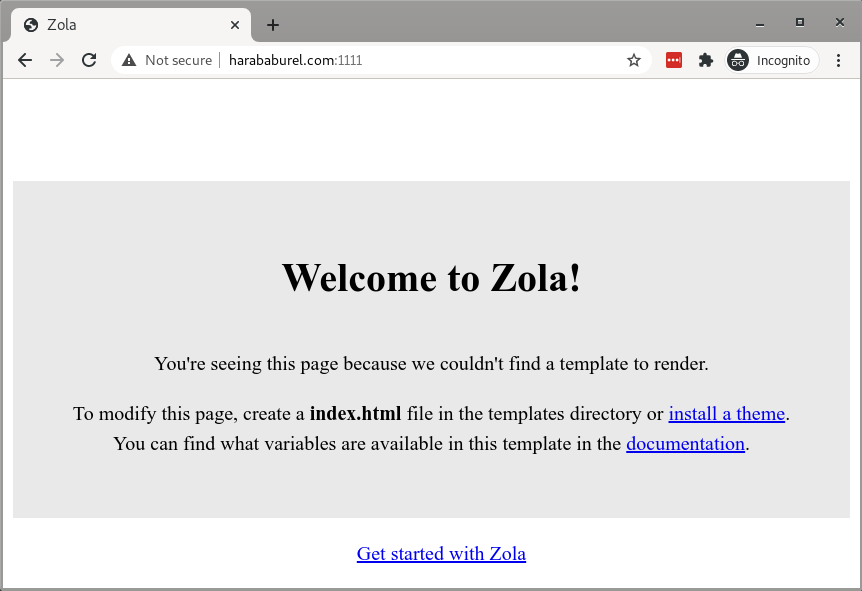

+++
title = "Building This Blog With Zola"
date = 2021-02-10
+++

While looking for options of reviving my old blog, I initially wanted to use the same platform as before -- [Ghost](https://ghost.org/). After assessing [the state of Ghost on Arch](http://harababurel.com/blog/state-of-ghost-on-arch), I decided it's probably not worth the effort so I did some research on [HN](http://news.ycombinator.com/). Some solutions came up repeatedly:

* [Bear](https://bearblog.dev) -- this would have been my first choice but it does not currently support self hosting.
* [Micro.blog](https://micro.blog/) -- I want a free solution, especially as I am hosting it on my own server.
* [Blot](https://blot.im/) -- same.
* [Medium](https://medium.com/) -- there are no words for how much I hate paywalls and gated content. It's also one of the reasons I stopped reading [Quora](https://quora.com) years ago. If your website is going to ask me to (1) disable my adbocker, (2) create a "free" account or (3) sign up for a paid subscription, I will just close it and move on with my life.
  
  On the same note, I have some resistance towards the whole concept of a centralized Internet. I don't like big social networks. The Internet was more fun when it consisted of a bunch of personal websites that people hosted themselves. If this resonates with you, it's also worth reading about [POSSE](https://indieweb.org/POSSE).

I eventually landed on [Zola](https://www.getzola.org/), which I used to generate this website. I chose this engine for a few reasons:

* it generates a simple site. I don't like complex/over-engineered services and bloated websites. I want a clean and simple landing page which is easy to navigate. This website is mostly a collection of Markdown files with some CSS thrown on top.

* it's implemented in Rust. I like Rust and have become familiar with it. As such, some concepts already come across more naturally. For example, Zola's config is written in [toml](https://www.getzola.org/documentation/getting-started/configuration/) which is already the [de-facto standard](https://doc.rust-lang.org/cargo/reference/manifest.html) for Rust.

* it's easy to set up. The [Arch User Repository](https://aur.archlinux.org/) already includes [zola](https://archlinux.org/packages/community/x86_64/zola/) as a community package.

* it's a simple tool. To emphasize this point, just take a look at what the arch package contains:

  ```bash
  $ trizen -Ql zola
  zola /usr/
  zola /usr/bin/
  zola /usr/bin/zola
  zola /usr/share/
  zola /usr/share/licenses/
  zola /usr/share/licenses/zola/
  zola /usr/share/licenses/zola/LICENSE
  ```

  Just one binary and a LICENSE file. That's it.

* it has a built-in web server for local development. Although I now use [nginx](https://www.nginx.com/) to serve the static files, this was extremely useful in the beginning for just trying stuff out.


## Setup and initial configuration

Installing Zola on Arch is straightforward. _Note:_ I use [trizen](https://github.com/trizen/trizen) instead of [pacman](https://wiki.archlinux.org/index.php/pacman).

```bash
$ trizen -S zola
:: Pacman command: /usr/bin/sudo /usr/bin/pacman -S zola
resolving dependencies...
looking for conflicting packages...

Packages (1) zola-0.13.0-1

Total Installed Size:  20.14 MiB

:: Proceed with installation? [Y/n] y
(1/1) checking keys in keyring                                    [####################################] 100%
(1/1) checking package integrity                                  [####################################] 100%
(1/1) loading package files                                       [####################################] 100%
(1/1) checking for file conflicts                                 [####################################] 100%
(1/1) checking available disk space                               [####################################] 100%
:: Processing package changes...
(1/1) installing zola                                             [####################################] 100%
:: Running post-transaction hooks...
(1/1) Arming ConditionNeedsUpdate...
```

The `zola` binary exposes the `init` command for initializing a blank website. I decided to create mine under `/srv/harababurel.com` alongside some of the other web services I host:

```bash
$ sudo mkdir /srv/harababurel.com
$ sudo chown sergiu:users /srv/harababurel.com/
$ cd /srv/
$ zola init harababurel.com
Welcome to Zola!
Please answer a few questions to get started quickly.
Any choices made can be changimged by modifying the `config.toml` file later.
> What is the URL of your site? (https://example.com): http://harababurel.com
> Do you want to enable Sass compilation? [Y/n]:
> Do you want to enable syntax highlighting? [y/N]: y
> Do you want to build a search index of the content? [y/N]: y

Done! Your site was created in /srv/harababurel.com

Get started by moving into the directory and using the built-in server: `zola serve`
Visit https://www.getzola.org for the full documentation.
```

This creates the following skeleton:

```bash
$ tree
.
├── config.toml
├── content
├── sass
├── static
├── templates
└── themes

5 directories, 1 file
```


## Built-in web server

You can preview the website quickly using `zola serve`. I'm using `0.0.0.0` instead of `127.0.0.1` in order to be able to access the server from outside the network.

```bash
$ zola serve -u 0.0.0.0 -i 0.0.0.0
Building site...
-> Creating 0 pages (0 orphan), 0 sections, and processing 0 images
Done in 5ms.

Listening for changes in /srv/harababurel.com{config.toml, content, sass, static, templates}
Press Ctrl+C to stop

Web server is available at http://0.0.0.0:1111
```

Which results in this:



Now, the official documentation suggests a certain [content structure](https://www.getzola.org/documentation/content/overview/) which is fairly intuitive. What I found more useful is this [list of examples](https://github.com/getzola/zola/blob/master/EXAMPLES.md), many of them having the source code publicly available. I personally like the design and structure used by [Vincent Prouillet](https://www.vincentprouillet.com/) (Zola's creator) which I've adopted as a starting point for my website.

All in all, this is the current file structure of this site:

```bash
$ tree -I public # exclude the auto-generated "public" dir
.
├── config.toml
├── content
│   └── blog
│       ├── _index.md
│       ├── building-this-blog-with-zola
│       │   ├── index.md
│       │   ├── medium-login-wall.png
│       │   ├── welcome-to-zola.png
│       │   └── zola-welcome.png
│       └── state-of-ghost-on-arch
│           └── index.md
├── sass
│   ├── _base.scss
│   ├── _blog.scss
│   ├── _layout.scss
│   ├── _normalize.scss
│   └── site.scss
├── static
│   ├── Rubik-Regular.ttf
│   └── thesis.pdf
├── templates
│   ├── base.html
│   ├── blog.html
│   ├── index.html
│   └── page.html
└── themes

8 directories, 18 files
```

## Editing

Since most content is in the form of Markdown files, I can just `ssh` into the server and write new content using a text editor.

The content can be updated using `zola build`. This renders the pages and exports everything as static files in the `public` dir.

I've added this line to my `.vimrc` to rebuild the site every time I hit `\zb`:

```vim
nnoremap <Leader>zb :!cd /srv/harababurel.com; zola build<CR>
```

This means there's no "save draft" option. All changes I make while writing a post show up incrementally as I'm making progress. This is good enough for now, but in the long term I want to improve the workflow. A better approach would be to have a separate server which is protected against the outside world and only accessible by me. Once I finish writing a post and I'm happy with the result, I can push the changes to the live server. Storing the files on git is also a common practice with static websites. This is all future work though so I'm not going to throw myself completely down the rabbit hole quite yet.

## Deployment

As mentioned above, the static site is served by nginx:


```conf
http {
  [...]
  server {
    listen 80;
    server_name harababurel.com;

    root /srv/harababurel.com/public;
    index index.html;
    error_page 404 404.html;

    location / {
      try_files $uri $uri/ =404;
    }
  }
  [...]
}
```
