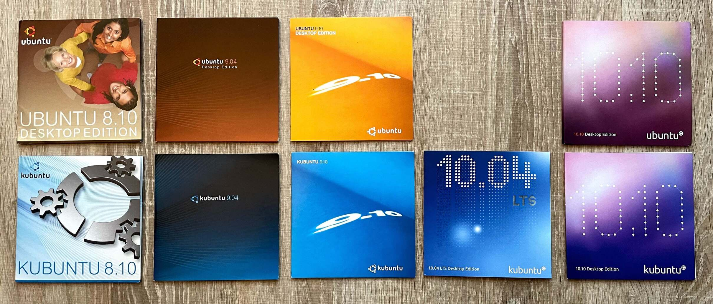
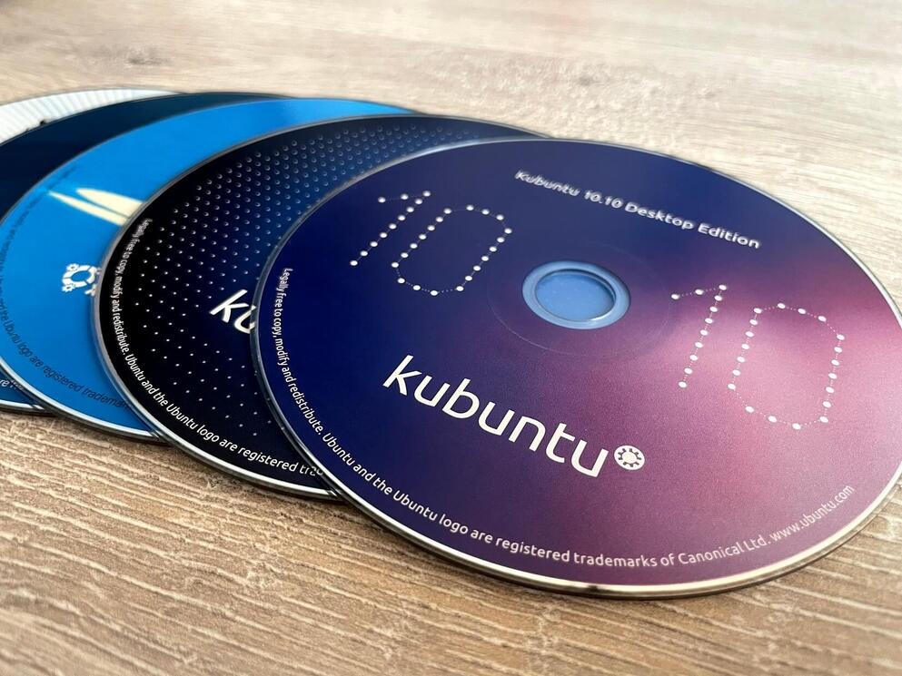
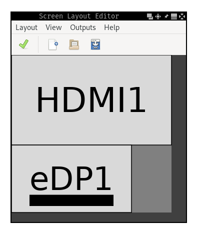
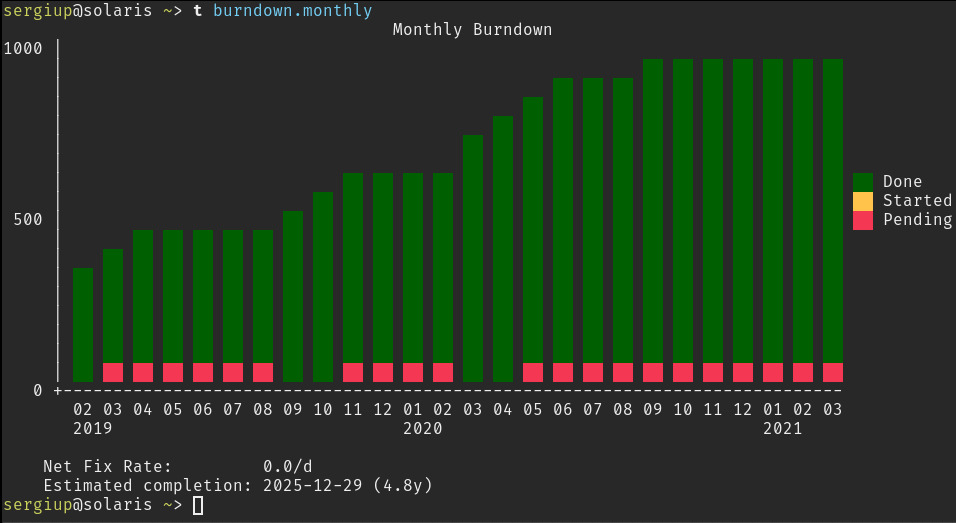
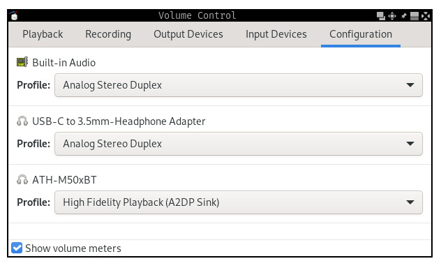

+++
title = "Favorite CLI tools (and some GUIs too)"
date = 2021-03-17
+++

My first contact with Linux happened around 2008, back when Canonical was still distributing Ubuntu in the form of free CDs. The program was [discontinued](https://ubuntu.com/blog/shipit-comes-to-an-end) in 2011. And yes, my official copy of Ubuntu 10.04 LTS has been lost in time:



I've accumulated many tools and scripts over the years. Some of them made my life easier, some ended up costing more time<sup>[[xkcd]](https://xkcd.com/1205/)</sup> to implement or figure out than they saved in the long run. This is a collection of those that I got the most use out of.



## ARandR

[ARandR](https://christian.amsuess.com/tools/arandr/) is a GUI for [XRandR](https://wiki.archlinux.org/index.php/Xrandr), the monitor configuration utility for X. The latter provides powerful but inconvenient controls. For example, this is how I can set up my external monitor to extend on top of my laptop screen:

```bash
$ xrandr --output eDP1  --mode 1920x1080 --rotate normal --primary \
         --output HDMI1 --mode 2560x1440 --rotate normal --above eDP1
```

For any other non-trivial setup, the command gets messy. You might end up setting absolute positions (`--pos`), changing refresh rates (`--rate`) or writing your custom scripts depending on several setups you cycle between (laptop only / home  / office).

ARandR simplifies this by allowing graphical control. The same `xrandr` command from above is equivalent to the following layout. Except now you don't have to remember any display names, supported resolutions or refresh rates.

<div align="center">



</div>

## Mons

[Mons](https://github.com/Ventto/mons) is another monitor management tool. It also uses `xrandr` under the hood and exposes the most common use-cases as simple commands. This is especially useful when paired with a window manager which doesn't handle monitor management natively.

The most common commands for me:

```bash
$ mons -o  # use only primary display
$ mons -e (top,left,right,bottom)  # extend the primary display on a particular side
$ mons -a  # switch to a single display automatically if the external monitor is disconnected
```

## exa

[exa](https://the.exa.website/) is a _modern replacement for `ls`_. It's fast, comes with better defaults (color output, human-readable sizes, etc) and expands on the features of `ls`. I've switched to it years ago: `alias ls 'exa -lg'`.

Examples:

```bash
$ exa -s new    # sort by newest
$ exa -T        # show a tree
$ exa -l --git  # show git information
```

## Taskwarrior

[Taskwarrior](https://taskwarrior.org/) is a CLI tool for managing your TODO list. It is often paired with the [GTD methodology](https://en.wikipedia.org/wiki/Getting_Things_Done) which I've applied on and off for the past couple of years.

My usual workflow looks like this:

```
$ task proj:work.ml add "write design doc" due:3d
Created task 64.
The project 'work.ml' has changed.
Project 'work.ml' is 91% complete (15 of 170 tasks remaining).

$ task annotate 64 "to be reviewed by X and Y"
Annotating task 64 'write design doc'.
Annotated 1 task.
Project 'work.ml' is 91% complete (15 of 170 tasks remaining).

$ task ls project:work.ml
ID D Project        Tags     Due  Description
64   work.ml                  2d  write design doc
                                    2021-03-14 to be reviewed by X and Y
25   work.ml        someday  1mo  enforce lowercase asset names
23   work.ml        2020Q4#3      add whackamole jobs to annealing
53   work.ml.router               create blade targets for main router
54 D work.ml        2020Q4#4 4mo  implement config watcher
55   work.ml        2020Q4#5 4mo  write one-pager about aliasing consistency
26   work.ml        obsolete      move partition into model metadata
```

I have different projects depending on what I'm working on. I usually set rough deadlines and dependencies between tasks and collect any helpful data (links to bugs, code changes, documentation, _etc._) as annotations. The brain behind Taskwarrior sorts existing tasks using a metric called **urgency**. For example, blocked tasks are less urgent than non-blocked ones. Tasks with upcoming deadlines are more urgent than tasks scheduled far into the future.

Once my work is added and classified properly, I go through `to` (overdue tasks) and `tt` (tasks which are due today):


```bash
alias t  'task'
alias ta 'task active'
alias tn 'task next'
alias to 'task overdue'
alias ts 'task sync'
alias tt 'task due:today'
alias whatdididothisweek 'task completed end.after:(date +%Y-%m-%d)-7d'
alias whatdididotoday 'task completed end.after:(date +%Y-%m-%d)'
```

Crossing an item off a list sometimes feels more rewarding than doing the actual work. I found this process helpful in keeping momentum when working on boring parts of my projects. It also helped when I was feeling a complete lack of progress. Instead of staying blocked, I could usually split my work into almost trivially-sized chunks and process them one at a time. The graphical reports are a nice bonus feature too:



On top of this, Taskwarrior can be deployed as a server. I've done this in order to have data consistency between all my clients:
* personal laptop
* work laptop
* remote workstation
* android phone ([app](https://play.google.com/store/apps/details?id=kvj.taskw&hl=en&gl=US))

as well as daily backups on Google Drive.

## Mosh

This is one I've known about since highschool (thanks to [Marius](https://ieval.ro/cv.txt)) but only got around to using very recently.

In short, [mosh](https://mosh.org/) is a replacement for SSH. From the surface, it looks and behaves extremely similarly. However, it has some [smart features](https://mosh.org/mosh-paper.pdf) which make it more resilient to intermittent connectivity.

The result is a remote connection which feels like a local terminal session. You can put your machine to sleep, come back to it a week later and resume instantly from where you left off.

Makes for a powerful workspace when combined with `tmux`.


## Alacritty

My [terminal emulator of choice](https://github.com/alacritty/alacritty). It's implemented in Rust, it's fast (GPU accelerated), easy to configure (YAML) and feels modern to use.

Some features such as scrolling or splitting tabs are excluded in the name of simplicity. While this can present a turn-off, I haven't noticed any drawbacks since `tmux` has already been fulfilling these needs for me.


## Spongebob

This is a [script](https://pastebin.com/raw/G8q5uT7r) I wrote a while ago to aid me in using the [mocking Spongebob](https://knowyourmeme.com/memes/mocking-spongebob) meme. Doesn't rank that high on the utility spectrum but it's fun enough.

<pre><code>❱ <span style="font-weight:bold;color:blue;">echo</span> <span style="color:#005fd7;">"you can't just automate yourself out of a job" |</span> <span style="font-weight:bold;color:blue;">spongebob</span>
YoU CaN'T jUsT AuToMAte YoUrSeLf oUt Of A JoB
</code></pre>

## `ss`

Another [script](https://pastebin.com/raw/Y8AKRmPC). This one uses [scrot](https://en.wikipedia.org/wiki/Scrot) to take a screenshot of an area, save it to `~/Pictures` and copy it to clipboard.

## `switch_sink`

[This one](https://pastebin.com/raw/1WKRrQ2m) comes in handy when there are multiple audio outputs (sinks) configured in [PulseAudio](https://wiki.archlinux.org/index.php/PulseAudio). For example, as shown in `pavucontrol`:

<div align="center">



</div>

`switch_sink` picks a random sink, sets it as default and moves all active streams to it. On my machine, it's mapped to the [`XF86Tools`](xf86tools.jpg) key. This lets me cycle all audio between the built-in laptop speakers, my external audio monitors and my bluetooth headphones at the press of a button.

## `dslr_webcam.sh`

For the past year I've been using my friend's DSLR camera as a webcam for video calls. I found a solution in the form of [gphoto2](http://www.gphoto.org/) which can create a _virtual video device_, also known as a V4L2 loopback device. The [script](https://pastebin.com/raw/gh60Pm64) uses `gphoto2` and `ffmpeg` to encode the stream.

The camera I'm using has an old (maybe proprietary?) connector and is very limited in terms of bandwidth. As such, it can only go up to ~480p 24fps. Still, the picture quality is much better and I can make use of my camera tripod and lenses. On top of this, I don't have to open my laptop in order to use the built-in webcam.

## `xclip`

[xclip](https://linux.die.net/man/1/xclip) is a command line interface to X selections (clipboard). I use it for copying the output of certain commands to my clipboard. For example:

```bash
$ cat /etc/hosts | xclip -selection clipboard
```

It also works with images (see <a href="#ss">`ss`</a>).

## `watch`

[watch](https://linux.die.net/man/1/watch) repeats a command every N seconds and updates the output in-place.

For example, monitoring CPU temperature:

```bash
$ watch -n 1 'sensors | grep "Core"'
```

```
Every 1.0s: sensors | grep "Core"
Core 0:        +44.0°C  (high = +100.0°C, crit = +100.0°C)
Core 1:        +45.0°C  (high = +100.0°C, crit = +100.0°C)
```

## Ranger

[Ranger](https://github.com/ranger/ranger) is a text-based file explorer based on curses. It has been an essential tool for navigating and exploring remote machines.

One of the most common non-trivial use cases is cleaning up large files. Ranger's vi keybindings make this easy: `vdcv` (in**v**ert selection, **d**isplay **c**ummulative sizes, in**v**ert again), followed by `os` (**o**rder by **s**ize). Then go through the results, `Space` to select and `:delete` as needed.

## Conclusion

As with most things, I've barely scratched the surface of what some of these tools are capable of. My usual strategy relies on (1) discovering features organically, as needed and (2) occasionally doing a quick refresh of a particular tool. Most of the time this is as simple as scanning the docs or man page to see that else the tool can do. Sometimes it's a more systematic approach, for example picking a random chapter of [Practical Vim](https://www.oreilly.com/library/view/practical-vim-2nd/9781680501629/) and using that as a way to fill knowledge gaps.
