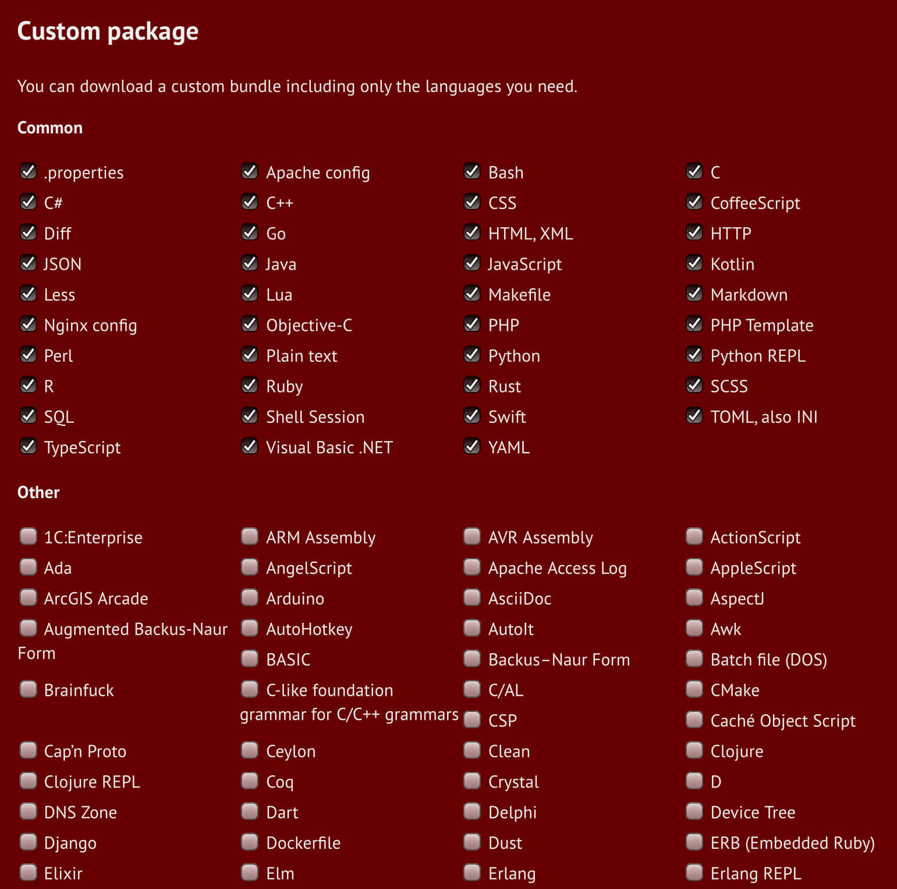

+++
title = "Preserving Terminal Colors on the Web"
date = 2021-02-27

[extra]
highlightjs = true
+++

There are a few different ways of adding code blocks to text-based web content, such as this blog post. I wanted to explore the available options in hope of finding a method that lets me preserve colors exactly as they are in the original text.

## Markdown

This post is mostly written in markdown. The built-in construct for a fenced code block (triple backticks) allows setting a language for syntax highlighting. For example:

<pre><code>```rust
pub fn is_drive_document(&self) -> bool {
    self.drive_file
        .as_ref()
        .and_then(|f| f.mime_type.clone())
        .map(|t| EXTENSIONS.contains_key::<str>(&t))
        == Some(true)
}
```
</code></pre>

Which renders as:

```rust
pub fn is_drive_document(&self) -> bool {
    self.drive_file
        .as_ref()
        .and_then(|f| f.mime_type.clone())
        .map(|t| EXTENSIONS.contains_key::<str>(&t))
        == Some(true)
}
```

The actual list of supported languages depends on the syntax highlighting engine. Zola supports [over 100](https://www.getzola.org/documentation/content/syntax-highlighting/) languages. GitHub uses [linguist](https://github.com/github/linguist) which has [over 500](https://github.com/github/linguist/blob/master/lib/linguist/languages.yml) language definitions.

This works fantastically well when writing code blocks in any of these predefined languages. The drawbacks are few and fairly minor: edge cases such as incorrect highlighting when using newer features of some languages or having custom prompts/commands when writing console snippets.

## HTML + JavaScript

There are many libraries for highlighting code on the web. The usual workflow involves:

- Linking in a CSS and JS file, either locally or using a CDN.
- Including a short script which triggers the highlighting logic.
- Marking the HTML code elements with a certain class such that the highlighting library can identify them.

One such library is [highlight.js](https://highlightjs.org). I included it in this page using a CDN and triggered the highlighter with a custom script. Since I'm not using highlight.js everywhere, I want to be able to enable it explicitly on certain elements.

```html
<link rel="stylesheet" href="//cdnjs.cloudflare.com/ajax/libs/highlight.js/10.5.0/styles/default.min.css">
<script src="//cdnjs.cloudflare.com/ajax/libs/highlight.js/10.5.0/highlight.min.js"></script>
```

```js
// Only after the page has loaded.
document.addEventListener("DOMContentLoaded", function() {
  // Highlight all <code class="highlightjs"> elements
  document.querySelectorAll('code.highlightjs').forEach(block => {
      hljs.highlightBlock(block);
  });
});
```

The same Rust snippet can then be included like this:

```rust
<pre>
  <code class="highlightjs" class="rust">
    // [...]
  </code>
</pre>
```

Which results in:

<pre style="background:#f0f0f0;"><code class="highlightjs" class="rust">pub fn is_drive_document(&self) -> bool {
    self.drive_file
        .as_ref()
        .and_then(|f| f.mime_type.clone())
        .map(|t| EXTENSIONS.contains_key::<str>(&t))
        == Some(true)
</code></pre>

One advantage of this approach is the ability of customizing the library. You can choose to include only the languages that you care about. This reduces the payload and can make your web page load faster (compared to linking the complete library) as a result.



Changing the colorscheme also becomes trivial. Just pick a different CSS from the [available styles](https://github.com/highlightjs/highlight.js/tree/master/src/styles).

If highlight.js falls short in some way, there are many other alternatives to experiment with:

* [SHJS](http://shjs.sourceforge.net)
* [Rainbow](https://craig.is/making/rainbows)
* [Prism](https://prismjs.com)
* [microlight.js](https://github.com/asvd/microlight)
* [EnlighterJS](https://github.com/EnlighterJS/EnlighterJS)

## ANSI escapes

Previous solutions rely on the assumption that the highlightable content is written in a recognized, well-defined language and does not contain errors. This is not always true. In the past, I found myself in situations where I wanted to capture the output of a terminal session without losing any color information. It is possible to programmatically highlight [console sessions](https://github.com/github/linguist/blob/b2834449f1dd9dd9b76652092bad9fc593f687d3/lib/linguist/languages.yml#L5314) but it fails more often than not. This is increasingly problematic since many CLI tools benefit from color output nowadays. In most cases, colors increase readability and improve the user experience.

But there are many different tools which use colors and the output can be virtually anything. No predefined structure which lends itself to easy color matching.

In this case, you have to dig one layer deeper and access the [ANSI escape codes](https://en.wikipedia.org/wiki/ANSI_escape_code). These are binary sequences embedded into text which dictate how it should be displayed in terms of color, styling and other variables. The name comes from the first character in such a code which is usually an ASCII escape character. ANSI codes are used extensively by terminal emulators.

However, they are for the most part not human readable. For example, the following mess converts into a nicely colored sentence:

```
^[[1;34mthis ^[[33mis ^[[31mcolored^[[32m text
```

<pre>
<span style="font-weight:bold;color:blue;">this </span><span style="font-weight:bold;color:olive;">is </span><span style="font-weight:bold;color:red;">colored</span><span style="font-weight:bold;color:green;"> text
</span></pre>

In order to get this working, two things must be done:

### Capturing ANSI information

Copying and pasting colored text from a terminal emulator will most likely lose any color information. Redirecting all output to a file will likely do the same. This can be explained by an excerpt taken from the `ls` [manpage](https://man7.org/linux/man-pages/man1/ls.1.html):

<pre>Using  color  to distinguish file types is disabled both by default and
with <b>--color</b>=<i>never</i>.  With <b>--color</b>=<i>auto</i>, ls emits color codes only  when
standard  output is connected to a terminal.  The <b>LS_COLORS</b> environment
variable can change the settings.  Use the dircolors command to set it.</pre>

One workaround is to set `--color=always` and redirect the output to a file. Of course, this solution only works for commands which have such a flag. It also gets messy when working with interactive programs, since it essentially separates away all user input. Instead of having a single interactive session, you end up with a blank terminal used only for input and another one for `tail`-ing the output file. Not a great experience.

Luckily, we have [script](https://man7.org/linux/man-pages/man1/script.1.html). This tool creates a log of a terminal session and saves it to disk:

```
~ ❱ script
Script started, output log file is 'typescript'.
~ ❱ exa -l /srv
dr-xr-xr-x - root   19 Jan  2:32 ftp
drwxrwxr-x - sergiu 20 Feb 14:25 ghost
drwxr-xr-x - sergiu 17 Feb 12:47 harababurel.com
drwxr-xr-x - root   19 Jan  2:32 http
drwxr-xr-x - http   10 Feb 14:57 manythanks
~ ❱ exit
Script done.
```

The result is a binary file which will show exactly the same terminal information when `cat`. For what it's worth, here's what a [hexdump](typescript-hexdump.html) of it looks like.

Fun fact: if `script` is executed with timing information (`-T, --log-timing file`) it can be replayed at a later time using `script-replay`. This essentially simulates your shell interaction in real time.

### Converting ANSI to HTML

The captured logfile is not useful on its own. It needs to be converted to HTML tags which convey the same information in a human readable form. I found a few tools for doing this. The ones I tried are [ansi2html](https://github.com/pycontribs/ansi2html) and [aha](https://github.com/theZiz/aha). In my limited testing, `aha` provided better results and required less cleanup overall so I'm going to use it to illustrate this step.

```bash
$ aha -f typescript --no-header > render.html
```

The generated HTML is included below and looks much better than plaintext:
<pre><code><span style="font-weight:bold;">~</span> ❱ <span style="font-weight:bold;color:blue;">exa</span> <span style="color:#005fd7;">-l /srv</span>
<span style="color:dimgray;"></span><span style="color:dimgray;"></span><span style="font-weight:bold;color:blue;">d</span><span style="font-weight:bold;color:olive;">r</span><span style="color:#808080;">-</span><span style="font-weight:bold;color:green;">x</span><span style="color:olive;">r</span><span style="color:#808080;">-</span><span style="color:green;">x</span><span style="color:olive;">r</span><span style="color:#808080;">-</span><span style="color:green;">x</span> <span style="color:#808080;">-</span> root   <span style="color:blue;">19 Jan  2:32</span> <span style="font-weight:bold;color:blue;">ftp</span>
<span style="font-weight:bold;color:blue;">d</span><span style="font-weight:bold;color:olive;">r</span><span style="font-weight:bold;color:red;">w</span><span style="font-weight:bold;color:green;">x</span><span style="color:olive;">r</span><span style="color:red;">w</span><span style="color:green;">x</span><span style="color:olive;">r</span><span style="color:#808080;">-</span><span style="color:green;">x</span> <span style="color:#808080;">-</span> <span style="font-weight:bold;color:olive;">sergiu</span> <span style="color:blue;">20 Feb 14:25</span> <span style="font-weight:bold;color:blue;">ghost</span>
<span style="font-weight:bold;color:blue;">d</span><span style="font-weight:bold;color:olive;">r</span><span style="font-weight:bold;color:red;">w</span><span style="font-weight:bold;color:green;">x</span><span style="color:olive;">r</span><span style="color:#808080;">-</span><span style="color:green;">x</span><span style="color:olive;">r</span><span style="color:#808080;">-</span><span style="color:green;">x</span> <span style="color:#808080;">-</span> <span style="font-weight:bold;color:olive;">sergiu</span> <span style="color:blue;">17 Feb 12:47</span> <span style="font-weight:bold;color:blue;">harababurel.com</span>
<span style="font-weight:bold;color:blue;">d</span><span style="font-weight:bold;color:olive;">r</span><span style="font-weight:bold;color:red;">w</span><span style="font-weight:bold;color:green;">x</span><span style="color:olive;">r</span><span style="color:#808080;">-</span><span style="color:green;">x</span><span style="color:olive;">r</span><span style="color:#808080;">-</span><span style="color:green;">x</span> <span style="color:#808080;">-</span> root   <span style="color:blue;">19 Jan  2:32</span> <span style="font-weight:bold;color:blue;">http</span>
<span style="font-weight:bold;color:blue;">d</span><span style="font-weight:bold;color:olive;">r</span><span style="font-weight:bold;color:red;">w</span><span style="font-weight:bold;color:green;">x</span><span style="color:olive;">r</span><span style="color:#808080;">-</span><span style="color:green;">x</span><span style="color:olive;">r</span><span style="color:#808080;">-</span><span style="color:green;">x</span> <span style="color:#808080;">-</span> http   <span style="color:blue;">10 Feb 14:57</span> <span style="font-weight:bold;color:blue;">manythanks</span>
<span style="font-weight:bold;">~</span> ❱ <span style="font-weight:bold;color:blue;">exit</span>
</code></pre>

The tool is not perfect. In my personal setup, I use the [fish](https://fishshell.com) shell with many autocomplete plugins. Some of them output ANSII escape codes in real time as I'm typing. This messes up the log file so I have to manually go in and do some cleanup afterwards. Most of it boils down to carriage returns (`^M`) and other unparsed garbage (special characters, partial autocomplete snippets, etc). I've tried the same exercise on bash with a blank `.bashrc` and had much better results. There's certainly room for improvement and refinements to be done.

## Conclusion

For the most part, I think the simple Markdown code blocks work best. But for anything terminal-related I would like to find a better workflow around ANSI codes and tools like `aha`. Either fix the bad interaction with fish (possibly by turning off autocomplete suggestions temporarily) or maybe switch to bash altogether when recording terminal interaction snippets.
