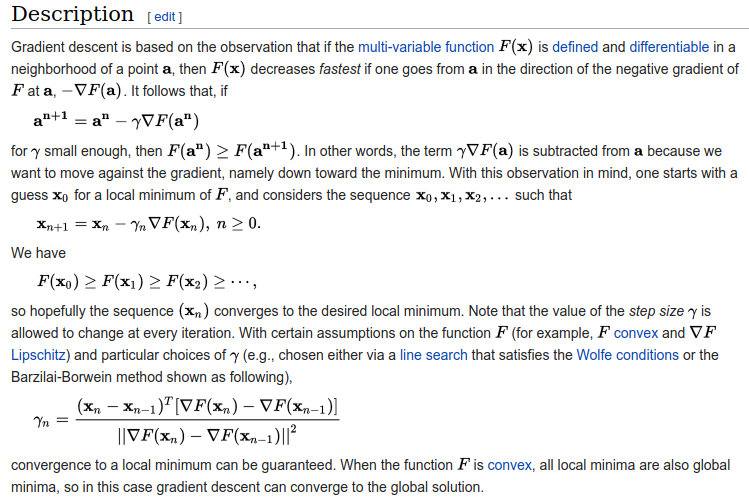
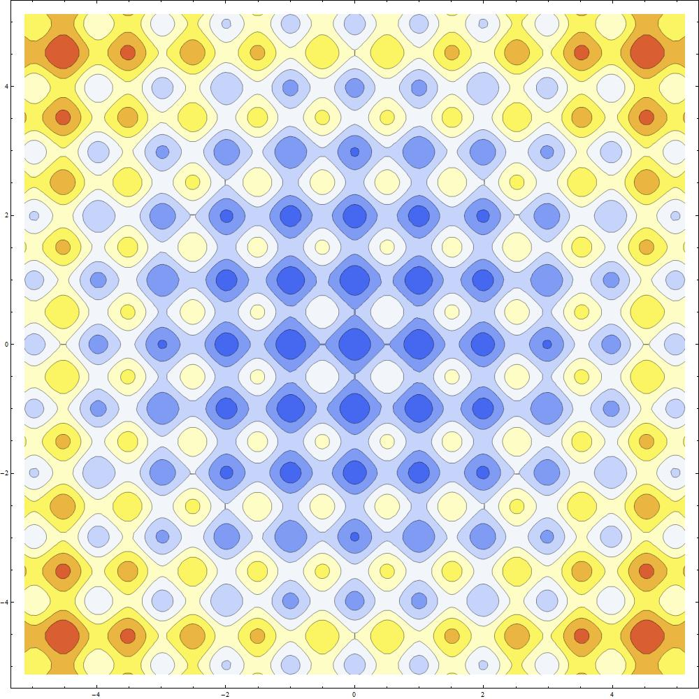

+++
title = "Putting the Fun in Function Optimization"
date = 2018-05-02

[extra]
plotlyjs = true
katexjs = true
+++


The problem of finding the maximum (or minimum) of a real function is often encountered in real-life problems. This is especially true when the function describes how close a solution is to some pre-established aim.

We as humans have the natural instinct of searching for better ways to do things:
- finding a shorter route to work
- earning a higher grade while studying less
- finding a balance between all areas of our lives which leads to highest level of happiness
- and the list goes on

Naturally, not all of these targets are easily quantifiable or achievable, but constructing an appropriate model for such a complex problem is the first step towards solving it.

## The textbook way

There are [many known methods](https://en.wikipedia.org/wiki/Mathematical_optimization#Computational_optimization_techniques) of finding the maximum (or minimum) of a real function.

Some of the more popular ones - *[Gradient Descent](https://en.wikipedia.org/wiki/Gradient_descent), for instance* - became known in the mainstream CS community due to their applicability in [Machine Learning](https://www.coursera.org/learn/machine-learning) and their simplicity of implementation:


```matlab
function [theta, J_history] =
    gradientDescent(X, y, theta, alpha, num_iters)

% GRADIENTDESCENT Performs gradient descent to learn theta
%   theta = GRADIENTDESENT(X, y, theta, alpha, num_iters)
%   updates theta by taking num_iters gradient steps with
%   learning rate alpha

m = length(y); % number of training examples
J_history = zeros(num_iters, 1);

for iter = 1:num_iters
    rsum_0 = 0;
    rsum_1 = 0;

    for i=1:m,
        rsum_0 += (X(i,:) * theta - y(i)) * X(i, 1);
        rsum_1 += (X(i,:) * theta - y(i)) * X(i, 2);
    end

    theta = [theta(1) - (alpha / m) * rsum_0;
             theta(2) - (alpha / m) * rsum_1];

    % Save the cost J in every iteration
    J_history(iter) = computeCost(X, y, theta);
end
```

The problem with such methods is their mathematical complexity. It is considerably more difficult to understand the inner workings and intuition behind gradient descent than it is to actually implement it.

Coming up with the algorithm from first principles requires a strong mathematical background. Just opening the [Wikipedia article](https://en.wikipedia.org/wiki/Gradient_descent#Description) is enough to scare most programmers away, when they encounter this:



## A more intuitive way

Luckily, there is a class of heuristic-based optimization techniques which perform on-par with the **mathematically proven™** methods, when tuned properly. Most of these algorithms are heavily inspired from natural phenomena, ranging from the movement of [bees in a colony](https://en.wikipedia.org/wiki/Artificial_bee_colony_algorithm), to [Darwin](https://en.wikipedia.org/wiki/Charles_Darwin)'s theory of evolution by [natural selection](https://en.wikipedia.org/wiki/Natural_selection).

### Particle Swarm Optimization

This particular technique was initially designed as a model to represent the movement of flocks of birds or groups of fish. Later analysis showed that the algorithm was performing optimization.

Assume that we want to minimize a $2$-dimensional real function (this method also works for $n$-dimensional functions). The main idea behind PSO can be described as follows:

- A particle represents a potential solution (*i.e.* a pair $(x, y)$). From this point forward, we will be refering to this pair as the **position** of the particle.
- Additionally, each particle is assigned a **velocity** (*i.e.* a pair $(dx, dy)$).
- Initially, a swarm of N randomly placed (or uniformly distributed) particles is generated in the function domain.
- The **fitness** of each particle (*i.e.* how well it performs as a solution) is computed; this is equivalent to the actual value of the given function at the position of each particle. Our aim is to minimize this fitness.
- Each particle keeps track of its best previously encountered position. In addition, we also keep track of the best position ever encountered by any particle in the swarm.

The optimization takes place over the span of multiple iterations. Every iteration works like this:

- Each particle moves to a new position, by adding its velocity to the current position.
- The velocity is then recomputed as a weighted average of three factors:
    - current velocity (weight $\omega$))
    - the best position of the particle (weight $\phi_{p_{i}}$)
    - the best position of the entire swarm (weight $\phi_{G}$)

    ```python
    # p and g are randomly generated in [-1.0, 1.0]
    # they act as mutations

    def updateVelocity(self, i, p, g):
      deltaParticle = self.bestPos[i] - self.pos[i]
      deltaSwarm = self.swarm.bestPos[i] - self.pos[i]

      newComponent = omega * self.velocity[i] \
                   + phiP * p * deltaParticle \
                   + phiG * g * deltaSwarm

      if i == 0:
        self.velocity = (newComponent, self.velocity[1])
      else:
        self.velocity = (self.velocity[0], newComponent)
    ```

- The best position for each particle and for the colony are updated.

There is a bit of work involved in choosing appropriate values for $\omega$, $\phi_{p_{i}}$ and $\phi_{G}$, but this job becomes considerably less difficult after understanding how each of these parameters affects the colony.

This set of rules leads to a tremendously organic behaviour. There is no magic behind the scenes; it's just particles that explore the problem domain while learning from their past experience and from each other.

## Testing

Wikipedia provides [a list of functions](https://en.wikipedia.org/wiki/Test_functions_for_optimization) designed specifically for evaluating the performance of optimization algorithms. These are the results I obtained on a subset of them:

### McCormick

Formula: $f(x, y) = sin(x+y) + (x-y)^2 - 1.5x + 2.5y + 1$

Global minimum: $ f(-0.54719, -1.54719) = -1.9133 $

Best solution found: $ f(-0.54710, -1.54724) = -1.913223 $

Plot:

<div id="McCormick" style="min-width:60%; max-width:60%; min-height:500px; margin: 0 auto;"></div>
<video width="auto" height="auto" style="max-width:60%; display:block; margin: 0 auto;" controls>
  <source src="mccormick.webm" type="video/webm">
Your browser does not support the video tag.
</video>

Notes:
- There is a noticeable cluster of particles that gravitate around a local minimum, also visible in the function plot.
- A set of $100$ particles and approximately $200$ iterations suffice for finding the global minimum with a precision of $ 10^{-3} $; further improvements require additional iterations.

### Eggholder

Formula: $ f(x, y) = -(y+47) * sin \sqrt {\left | \frac{x}{2} + (y+47)  \right |} - x * sin \sqrt{\left |  x - (y+47) \right |} $

Global minimum: $ f(512, 404.2319) = -959.6407 $

Best solution found: $ f(482.03561, 432.59104) = -956.879905 $

Plot:

<div id="Eggholder" style="min-width:60%; max-width:60%; min-height:500px; margin: 0 auto;"></div>
<video width="auto" height="auto" style="max-width:60%; display:block; margin: 0 auto;" controls>
  <source src="eggholder.webm" type="video/webm">
Your browser does not support the video tag.
</video>

Notes:
- Because of the numerous local minima of this function, we need to start with a larger set of particles ($500$), such that there is a higher chance of at least one particle being *on the right track* straight from the beginning.
- Same as before, most particles tend to form clusters corresponding to local minima. This is a common problem encountered by [Hill climbing](https://en.wikipedia.org/wiki/Hill_climbing) algorithms.

### Rastrigin

Formula: $ f(x) = A\*n + \sum_{i=1}^{n} \left [ x_{i}^{2} - A * cos \left ( 2  \pi x_{i} \right )\right ] $ where $A = 10$ and $x$ is an $n$-dimensional vector ($n=2$).

Global minimum: $ f(0, 0) = 0 $

Best solution found: $ f(0.00181, 0.00083) = 0.000785 $

Plot:

<div id="Rastrigin" style="min-width:60%; max-width:60%; min-height:500px; margin: 0 auto;"></div>

Contour:



<video width="auto" height="auto" style="max-width:60%; display:block; margin: 0 auto;" controls>
  <source src="rastrigin.webm" type="video/webm">
Your browser does not support the video tag.
</video>

Notes:
- There are a couple of noticeable direction changes in the entire swarm (starting at iteration $40$ and $170$). This behavior illustrates the concept of **swarm intelligence**: as soon as a particle finds a new best solution for the colony, all other particles start to follow it.
- The final placement of the swarm resembles the grid-like pattern shown in the contour plot.

### Easom

Formula: $ f(x,y) = -cos \left ( x \right ) cos \left ( y \right ) exp \left ( -\left ( \left ( x - \pi \right )^{2} + \left ( y - \pi \right )^{2}   \right ) \right ) $

Global minimum: $ f(\pi, \pi) = -1 $

Best solution found: $ f(3.14158, 3.14163) = -1.000000 $

Plot:

<div id="Easom" style="min-width:60%; max-width:60%; min-height:500px; margin: 0 auto;"></div>
<video width="auto" height="auto" style="max-width:60%; display:block; margin: 0 auto;" controls>
  <source src="easom.webm" type="video/webm">
Your browser does not support the video tag.
</video>

Notes:
- Nice method for approximating the value of $\pi$. :)</li>
- In this simulation, I used a relatively large value for $\omega$. As a result, each particle tends to stick more to its current direction, which makes the particles' paths more distinctive.

### Cross-in-tray

Formula: $ f(x, y) = -(10^{-4}) \left [ \left | sin\left ( x \right )  sin\left ( y \right ) exp \left ( \left | 100 - \frac{\sqrt{x^{2}+y^{2}}}{\pi} \right | \right ) \right | + 1 \right ]^{0.1} $

Global minimum: $ f(\pm1.34941, \pm1.34941) = -2.06261 $

Best solution found: $ f(1.34830, 1.34880) = -2.062612 $

Plot:

<div id="Cross-in-tray" style="min-width:60%; max-width:60%; min-height:500px; margin: 0 auto;"></div>
<video width="auto" height="auto" style="max-width:60%; display:block; margin: 0 auto;" controls>
  <source src="cross-in-tray.webm" type="video/webm">
Your browser does not support the video tag.
</video>

Notes:
- All 4 global minima are discovered.
- Similar to the [Rastrigin](#rastrigin) function, the entire swarm changes direction once a better solution is found.

## Conclusion

Optimization techniques usually behave really well on real functions, but they are not limited to this scope. I chose this application because it can provide insightful data visualization more easily than other use cases.

The code can be found on [GitHub](https://github.com/harababurel/homework/blob/master/sem4/ai/lab4/15.py).

<script type="text/javascript" async>
functions = [
  {
    'name': 'McCormick',
    'xMin': -1.5,
    'xMax': 4,
    'yMin': -3,
    'yMax': 4,
    'step': 0.2,
    'f': (x, y) => Math.sin(x + y) + Math.pow(x - y, 2) - 1.5 * x + 2.5 * y + 1,
  },
  {
    'name': 'Cross-in-tray',
    'xMin': -10,
    'xMax': 10,
    'yMin': -10,
    'yMax': 10,
    'step': 0.2,
    'f': (x, y) => -0.0001 *
        Math.pow(
            Math.abs(
                Math.sin(x) * Math.sin(y) *
                Math.exp(
                    100 -
                    Math.sqrt(Math.pow(x, 2) + Math.pow(y, 2)) / Math.PI)) +
                1,
            0.1)
  },
  {
    'name': 'Eggholder',
    'xMin': -512,
    'xMax': 512,
    'yMin': -512,
    'yMax': 512,
    'step': 8,
    'f': (x, y) => -(y + 47) * Math.sin(Math.sqrt(Math.abs(x / 2 + (y + 47)))) -
        x * Math.sin(Math.sqrt(Math.abs(x - (y + 47)))),
  },
  {
    'name': 'Easom',
    'xMin': Math.PI - 8,
    'xMax': Math.PI + 8,
    'yMin': Math.PI - 8,
    'yMax': Math.PI + 8,
    'step': 0.2,
    'f': (x, y) => -Math.cos(x) * Math.cos(y) *
        Math.exp(-(Math.pow(x - Math.PI, 2) + Math.pow(y - Math.PI, 2))),
  },
  {
    'name': 'Rastrigin',
    'xMin': -5.12,
    'xMax': 5.12,
    'yMin': -5.12,
    'yMax': 5.12,
    'step': 0.1,
    'f': (x, y) => 10 * 2 + Math.pow(x, 2) - 10 * Math.cos(2 * Math.PI * x) +
        Math.pow(y, 2) - 10 * Math.cos(2 * Math.PI * y)
  },
];


function plot(f) {
  var xs = Array.from(
      {length: Math.ceil((f['xMax'] - f['xMin']) / f['step'])},
      (x, i) => f['xMin'] + i * f['step']);
  var ys = Array.from(
      {length: Math.ceil((f['yMax'] - f['yMin']) / f['step'])},
      (x, i) => f['yMin'] + i * f['step']);
  var zs = [];

  for (let x of xs) {
    heights = [];
    for (let y of ys) {
      heights.push(f['f'](x, y));
    }
    zs.push(heights);
  }

  console.log(f['name']);
  console.log(xs.length, ys.length, xs.length * ys.length);

  var data = [{
    x: xs,
    y: ys,
    z: zs,
    type: 'surface',
    showscale: false,
    colorscale: 'Viridis',
  }];

  var layout = {
    title: false,
    autosize: true,
    showlegend: false,
  };

  Plotly.newPlot(f['name'], data, layout);
}

functions.forEach(plot);
</script>

<!-- <script async> -->
<!--   renderMathInElement(document.body); -->
<!-- </script> -->

</div>
