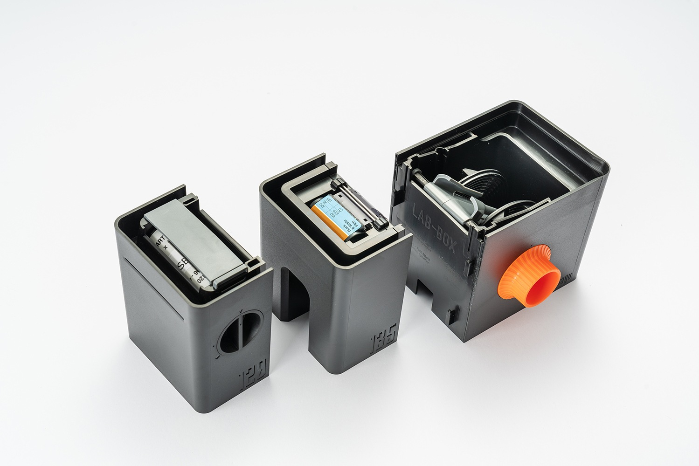
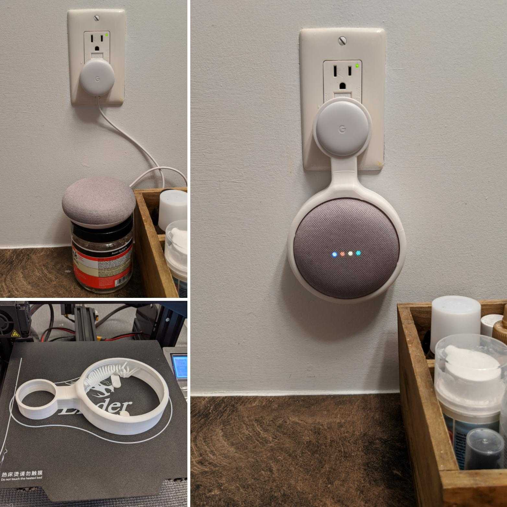

+++
title = "Things I want to 3D print"
date = 2022-01-06
+++

In no particular order:

* A mini Simpsons TV (inspired from [this](https://withrow.io/simpsons-tv-build-guide)).
* A working [Curta calculator](https://en.wikipedia.org/wiki/Curta).
* Board game organizers, dice, familiars, trays, etc.
* A miniature model of my head based on 3d scans.
* Replacement headband for my broken headphones.
* A small scale replica of my home.
* Auto-agitator for the Lab Box.
  
* Google Home Mini wall holder
  
* Programmable curtain/blinds controller.
* HDD rack for home server.
* Spring loaded caliper case.
* Alphabet shelf separators for organizing vinyl records.
